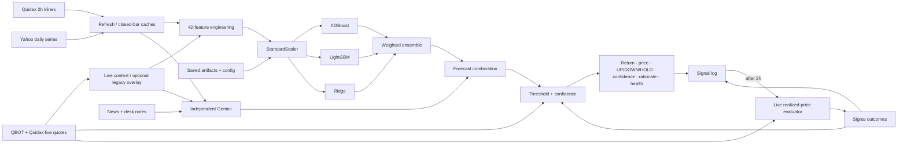

# USD/NGN Prediction and Desk-Decision System

## Purpose

The system predicts Quidax USDT/NGN’s next 2-hour fractional return—the OTC USD/NGN execution-price proxy—and converts it to a ₦/USDT forecast and `UP`, `DOWN`, or `HOLD`. The active entry point is `app/main.py::run_prediction` ([lines 1061–1265](app/main.py#L1061)); order execution is **Not implemented**.

## Inputs and processing

| Input | Source/provider | Frequency/granularity | Processing | Used by |
|---|---|---|---|---|
| Historical USDT/NGN and BTC/NGN | Quidax `/k`; runtime CSV | 2-hour; ≤1,000/pull; scheduler **Not implemented** | Left-join BTC; derive `implied_btcusd_quidax`; zero unused trade fields; drop open UTC bar; cache (`scripts/refresh_runtime_data.py:18–125`). Use 480 bars. Runtime CSV wins; export fallback. | Features |
| Live USDT/NGN and BTC/NGN | QBOT current rate; Quidax ticker | Per prediction | QBOT `last`=`sellRate` (else `midRate`); bid/ask supply anchor/spread. BTC changes features only in export fallback: carry gaps forward, overlay current bucket. Runtime-CSV features stay closed-bar-only. Quote failure aborts. | Price, Gemini, confidence; fallback features |
| Macro/FX/oil/volatility/global BTC | Yahoo: `BZ=F`, `DX-Y.NYB`, `^VIX`, `USDZAR=X`, `USDNGN=X`, `USDGHS=X`, `USDKES=X`, `BTC-USD` | Daily; per run | UTC daily → 2-hour forward-fill → left join/forward-fill. Fresh cache wins; otherwise live merges with cache; live failure uses cache; neither available aborts (`market_data.py:54–180`). | Features; Gemini subset |
| News and desk notes | 11 Google queries, 8 RSS feeds, CBN page; human text | Per run; news ≤72h | Concurrent; categorise, rank, deduplicate; ≤25 headlines. Memory TTL 15m; disk fallback ≤2h; failure gives empty news. Notes pass verbatim. | Gemini only |
| Model artifacts/config | 3 model PKLs, scaler, feature/metadata JSON; threshold | Startup | Missing files abort; feature order authoritative; default `T=.003`, override allowed (`artifacts.py:29–52`). | Scaling/models/decision |
| 42-feature vector | Derived; `artifacts/feature_cols.json` | Latest 2-hour row | **Price/trend:** `return_2h`, `return_8h`, `return_24h`, `return_3d`, `return_7d`, `sma_5d_20d_cross`, `ema_macd`, `rsi_14`. **Macro:** `brent_roc_3d`, `brent_roc_7d`, `dxy_roc_3d`, `dxy_roc_7d`, `vix`, `vix_roc_7d`. **Cross-venue:** `btc_premium`, `btc_premium_ma_12`, `btc_premium_std_12`, `btc_premium_zscore`, `quidax_btc_corr_24h`, `parallel_vs_official`, `parallel_vs_official_zscore`, `parallel_vs_official_roc_24h`. **Volatility/range:** `realized_vol_24h`, `realized_vol_7d`, `vol_ratio`, `atr_14`, `atr_pct`. **Calendar:** `hour_sin`, `hour_cos`, `dow_sin`, `dow_cos`, `month_sin`, `month_cos`, `is_month_end`, `is_weekend_adjacent`. **Regional FX:** `usdzar_roc_1d`, `usdzar_roc_7d`, `usdghs_roc_1d`, `usdghs_roc_7d`, `usdkes_roc_1d`, `usdkes_roc_7d`, `africa_fx_composite`. ±∞→missing; missing required columns abort; values forward-fill then zero-fill; exact reorder (`features.py:24–131`). | Scaler |
| Historical signal outcomes | `app/signal_log.csv` | Each run; evaluator every 30–300s | Latest 20 evaluated directions, once ≥5 exist; no retraining. | Confidence |

## Models and decision logic

| Component | Architecture/role | Inputs | Processing/formula | Output |
|---|---|---|---|---|
| Training | Next-bar regression | 42 features; 2020-01-08 12:00–2026-03-10 02:00 UTC | `artifacts/usdngn_training_pipeline.ipynb`: target=`close.pct_change(1).shift(-1)`; weights `clip(exp(-ln2·age/180d),.05,1)`. Five expanding folds, 12-bar embargo; chronological 70/15/15. XGB: 50 Optuna trials maximizing 30-bp PnL after 5-bp cost; train+validation 22,313, holdout 3,938. | Artifacts; holdout direction 57.26%, or 76.92%/26 activated |
| StandardScaler | Z-score transform | Ordered vector | Fitted on train+validation; shared by all models. | Scaled row |
| XGBoost | Tuned boosted trees | Scaled row | Canonical parameters: `model_metadata.json`. | `xgb_pred` |
| LightGBM | Boosted-tree diversifier | Scaled row | 200 trees; depth 5; rate .05; subsample .8; column sample .7; λ=2. | `lgbm_pred` |
| Ridge | Linear diversifier | Scaled row | α=1. | `ridge_pred` |
| Quant ensemble | Primary forecast | Three predictions | `raw=.50·xgb+.30·lgbm+.20·ridge`. | Raw return |
| Gemini branch | Independent overlay | Spot/momentum; `Brent/DXY/VIX/BTC-premium/official-gap/USDGHS`; news; notes—never ML forecast | JSON sentiment `s∈[-1,1]`, magnitude `e∈[0,1]`, narrative, ≤6 drivers. Any failure → `s=e=0`, no drivers. | Context; `s·.001` (±10 bp) |
| Combination/decision | Desk classifier | `a=raw+s·0.001`, live price `P`, threshold `T` | `a≥T→UP`; `a≤−T→DOWN`; else `HOLD`. Forecast price=`P(1+a)`. | Decision and price |
| Confidence | Heuristic score, independent of activation | 3 predictions, `a,T`, age, spread, `e`, outcomes | Rounded points: agreement `30·clamp(1−(σ−.0005)/.0035)`; magnitude `0` on HOLD, else `30·min(1,(|a|/T−1)/2)`; freshness `15·clamp(1−age/120m)`; spread `10·clamp(1−(spread_bp−50)/150)`; event penalty `−15·clamp((e−.3)/.7)`; history `15·clamp((accuracy−.50)/.20)`. Sum clamp 0–100; directional labels: HIGH ≥65, MEDIUM ≥40, else LOW; HOLD label blank (`main.py:727–821`). | Score, label, breakdown |
| Human control | **Policy only** | Recommendation | Documents require approval; code has no approval/override record. Notes exist; trading does not. | Human-consumed recommendation |

## Outputs and feedback

| Output | How derived | Decision meaning | Persistence/consumer |
|---|---|---|---|
| Raw model predictions and ensemble | Three returns; weighted `raw_forecast` | Quantitative 2h edge | Components transient; ensemble in latest pickle, not CSV |
| AI adjustment, rationale/drivers | Gemini adjustment/narrative/drivers; ML attribution **Not implemented** | Independent event evidence | Latest pickle; log keeps sentiment/magnitude |
| Adjusted return, price, signal, confidence | Combination, threshold, score | UP=favor USD; DOWN=favor NGN; HOLD=neutral | Latest pickle; adjusted return/price/signal/label in CSV |
| Source health | Quote and external-series statuses; news counts separately | Observability only; does not gate signal | Latest result |
| Two-hour outcome, accuracy, PnL | First QBOT quote at/after 2h vs entry. HOLD=`--`/0; PnL=`±|return|·10,000`; accuracy=`correct/evaluated`. | Ex-post, not execution PnL | CSV; accuracy feeds confidence; PnL reporting-only |

## Information flow

## Implementation notes

1. `app/services/inference.py` and `ratepredict/policy.py` are test-only/aspirational; no production call site reaches them. Active: `app/main.py`.
2. Methodology promises degradation modes, automatic unhealthy-source `HOLD`, and auditable human approval; active code reports health but applies none of those gates. The training blueprint’s consensus-anchor target also differs from the saved Quidax-close target.
3. The confidence comment says magnitude earns 10 points at 1× threshold, but the implemented formula earns 0 (15 at 2×, 30 at 3×). Outcome PnL also omits the 5-bp cost used in training evaluation.
